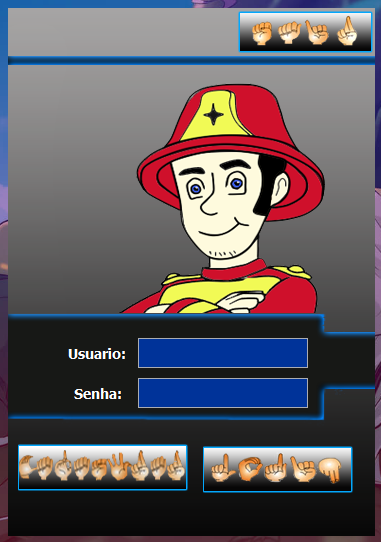
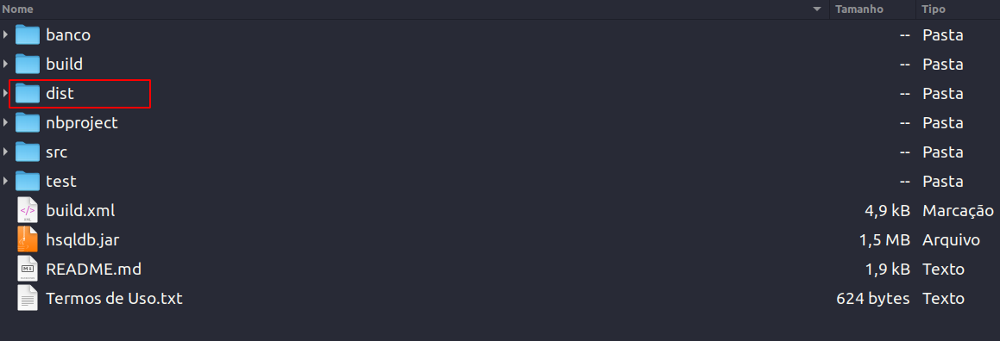
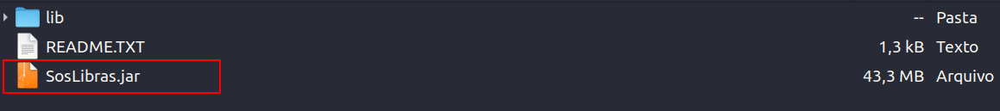

<h1 align="center"> SOSLibras </h1>

<p align="center">
Esse projeto foi desenvolvido como trabalho de conclusão de curso (TCC) de técnico de informática em 2017, o objetivo do projeto era criar um jogo em Java que ensinasse primeiros socorros paras as pessoas que utilizam a linguagem de sinais brasileira (Libras)
</p>

<p align="center">
  <a href="#-tecnologias">Tecnologias</a>&nbsp;&nbsp;&nbsp;|&nbsp;&nbsp;&nbsp;
  <a href="#-dependências">Dependências</a>&nbsp;&nbsp;&nbsp;|&nbsp;&nbsp;&nbsp;
  <a href="#-como-executar">Como Executar</a>&nbsp;&nbsp;&nbsp;|&nbsp;&nbsp;&nbsp;
  <a href="#memo-licença">Licença</a>
</p>

<p align="center">
  
</p>

<br>

<p align="center">
  
</p>
<p align="center">
  
</p>

## 🚀 Tecnologias

Esse projeto foi desenvolvido com as seguintes tecnologias:

- Java
- HSQLDB (banco de dados)


## ⚙️ Dependências
<p>
    Antes de mais nada, você precisa ter o Java instalado, já que sem ele você não irá conseguir rodar.
</p>
<p>
    Se você utiliza o Windows você pode baixar o Java através desse <a href="https://www.java.com/pt-BR/" target="_blank">link.</a> Agora se você utiliza o Linux provavelmente já deve vir com o Java instalado, para saber se o Java está intalado na sua distribuíção Linux, execute esse comando no terminal:
</p>

```CSS
    java --version

    /* 
    Se mostrar algo parecido com isso, significa que o Java está instalado:
    
    openjdk 11.0.18 2023-01-17
    OpenJDK Runtime Environment (build 11.0.18+10-post-Ubuntu-0ubuntu120.04.1)
    OpenJDK 64-Bit Server VM (build 11.0.18+10-post-Ubuntu-0ubuntu120.04.1, mixed mode, sharing)
    
    */
    
```

## 💻️ Como Executar
<p>Primeiro entre dentro do diretório "dist"</p>
<p align="center">
  
</p>
<p>Depois de entrar na pasta "dist" é só executar o arquivo SosLibras.jar</p>
<p align="center">
  
</p>


## ✅ Resolução de Problemas (Histórico de Correções)

Este projeto apresentava erros de conexão com o banco de dados e execução que impediam seu funcionamento. Abaixo está o detalhamento dos problemas e das soluções aplicadas.

**Problema 1: Erro de Conexão com o Banco de Dados**
*   **Sintoma:** Ao tentar cadastrar, ocorria o erro `SQLSyntaxErrorException: user lacks privilege or object not found: USUARIO`.
*   **Causa:** O caminho do banco de dados estava "hardcoded" (fixo) no código como absoluto (`C:/SOSLibras/banco/cadastro`). Como essa pasta não existia no computador do usuário, o HSQLDB criava um banco novo vazio, sem as tabelas necessárias.
*   **Solução:** Alteramos a classe `ConnectionFactory.java` para usar um caminho relativo (`jdbc:hsqldb:file:banco/cadastro`), permitindo que o sistema encontre o banco de dados dentro da própria pasta do projeto, independente de onde ele esteja salvo.

**Problema 2: Dependências Ausentes (ClassNotFoundException)**
*   **Sintoma:** O erro `ClassNotFoundException: org.hsqldb.jdbcDriver` impedia o início da conexão.
*   **Causa:** As bibliotecas necessárias (JARs) na pasta `dist/lib` estavam faltando ou não eram incluídas no Classpath durante a execução/compilação.
*   **Solução:** 
    1. Configuramos o VS Code (`settings.json`) para reconhecer as bibliotecas.
    2. Recriamos a pasta `dist/lib` e copiamos o driver `hsqldb.jar` corretamente via script de build.
    3. Criamos um `MANIFEST.MF` correto apontando para essas bibliotecas.

**Problema 3: Erro Silencioso de Conexão**
*   **Sintoma:** O usuário recebia apenas uma mensagem genérica "ATENÇÃO ouve algum erro...", sem detalhes.
*   **Solução:** Melhoramos o tratamento de exceções em `frmCadastrar.java` e `ConnectionFactory.java` para exibir pop-ups com a mensagem real do erro (ex: `con is null` ou stack traces), facilitando o diagnóstico.

---

## 💻️ Como Executar no VS Code

Este projeto agora está configurado para rodar facilmente no VS Code sem precisar instalar o Apache Ant manualmente.

1.  Abra a pasta do projeto no VS Code.
2.  Espere a extensão "Extension Pack for Java" carregar o projeto.
3.  Abra o arquivo `src/telaprincipal/frmPrincipal.java`.
4.  Clique em **Run** ou **Debug** (botão de Play acima da classe `main`).

## 📦 Como Gerar o Executável (Pasta dist)

Foi criada uma Tarefa Automatizada no VS Code para compilar e gerar a versão final para distribuição.

1.  No menu superior, vá em **Terminal** -> **Run Task...** (Executar Tarefa).
2.  Selecione a tarefa: **Gerar JAR e Copiar Banco**.
3.  O VS Code irá:
    *   Compilar as classes.
    *   Gerar o arquivo `dist/SosLibras.jar`.
    *   Criar a pasta `dist/lib` e copiar as dependências.
    *   Copiar a pasta `banco` atualizada para dentro de `dist`.

> **Nota:** Certifique-se de fechar qualquer execução do programa antes de rodar essa tarefa para evitar erro de arquivo travado.

## 🗄️ Como Acessar o Banco de Dados (HSQLDB)

Para ver as tabelas e dados cadastrados:

1.  Na extensão "Database Manager" do VS Code (ou execute o `DatabaseManagerSwing` do próprio HSQLDB).
2.  Configure a conexão com estes dados exatos:
    *   **Type:** HSQL Database Engine Standalone
    *   **Driver:** `org.hsqldb.jdbcDriver`
    *   **URL:** `jdbc:hsqldb:file:C:/Caminho/Para/Seu/Projeto/banco/cadastro` (Use o caminho completo da sua pasta)
    *   **User:** `sa`
    *   **Password:** (em branco)

---

## 🤖 Créditos e Agradecimentos

A resolução complexa destes problemas de infraestrutura, configuração de ambiente, correção de código legado e automação de build foi realizada com o auxílio da **IA Gemini 3 Pro (High)** integrada à IDE **Antigravity** do Google.


## :memo: Licença

Esse projeto está sob a licença MIT.

---

Feito com ♥ by Daniel :wave: 
