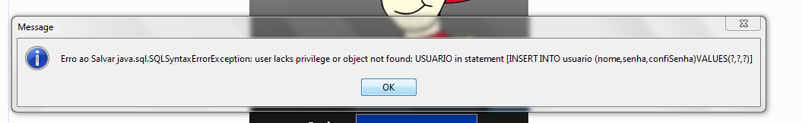

<h1 align="center"> SOSLibras </h1>

<p align="center">
Esse projeto foi desenvolvido como trabalho de conclusão de curso (TCC) de técnico de informática em 2017, o objetivo do projeto era criar um jogo em Java que ensinasse primeiros socorros paras as pessoas que utilizam a linguagem de sinais brasileira (Libras)
</p>

<p align="center">
  <a href="#-tecnologias">Tecnologias</a>&nbsp;&nbsp;&nbsp;|&nbsp;&nbsp;&nbsp;
  <a href="#-dependências">Dependências</a>&nbsp;&nbsp;&nbsp;|&nbsp;&nbsp;&nbsp;
  <a href="#-como-executar">Como Executar</a>&nbsp;&nbsp;&nbsp;|&nbsp;&nbsp;&nbsp;
  <a href="#memo-licença">Licença</a>
</p>

<p align="center">
  
</p>

<br>

<p align="center">
  
</p>
<p align="center">
  
</p>

## 🚀 Tecnologias

Esse projeto foi desenvolvido com as seguintes tecnologias:

- Java
- HSQLDB (banco de dados)


## ⚙️ Dependências
<p>
    Antes de mais nada, você precisa ter o Java instalado, já que sem ele você não irá conseguir rodar.
</p>
<p>
    Se você utiliza o Windows você pode baixar o Java através desse <a href="https://www.java.com/pt-BR/" target="_blank">link.</a> Agora se você utiliza o Linux provavelmente já deve vir com o Java instalado, para saber se o Java está intalado na sua distribuíção Linux, execute esse comando no terminal:
</p>

```CSS
    java --version

    /* 
    Se mostrar algo parecido com isso, significa que o Java está instalado:
    
    openjdk 11.0.18 2023-01-17
    OpenJDK Runtime Environment (build 11.0.18+10-post-Ubuntu-0ubuntu120.04.1)
    OpenJDK 64-Bit Server VM (build 11.0.18+10-post-Ubuntu-0ubuntu120.04.1, mixed mode, sharing)
    
    */
    
```

## 💻️ Como Executar
<p>Primeiro entre dentro do diretório "dist"</p>
<p align="center">
  
</p>
<p>Depois de entrar na pasta "dist" é só executar o arquivo SosLibras.jar</p>
<p align="center">
  
</p>


## ATENÇÃO: Bug
<p>
  Infelizmente não sei porque, mas tem um bug no banco de dados pra cadastrar e fazer login, como já faz mais de 5 anos que nunca mais programei em Java e utilizei banco de dados eu não sei como resolver esse bug.
</p>
<p align="center">
  
</p>
<p>
  Se por acaso conseguir resolver esse erro, faça um pull request pra me ajudar a trazer de volta a vida esse projeto.
</p>

## :memo: Licença

Esse projeto está sob a licença MIT.

---

Feito com ♥ by Daniel :wave: 
